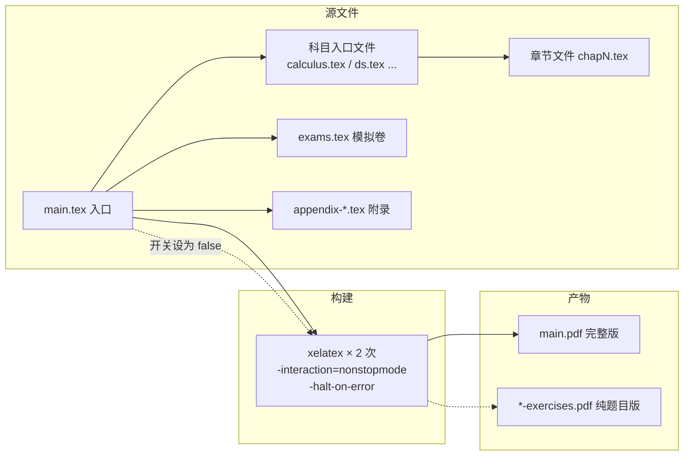
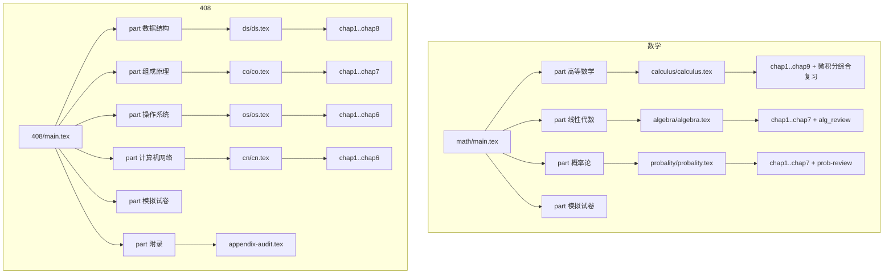

# 01 · 技术架构

> 本文档深入分析仓库的工程组织：构建体系、模块职责、文档组装链、数据/控制流、配置体系与扩展点。所有结论基于仓库源码与构建日志。

## 1. 构建体系总览

两本书都是**单入口 XeLaTeX 文档类项目**：



- **引擎**：XeLaTeX（`ctexbook` 文档类，`fontspec` 加载系统 Noto 字体——中文排版的必需路径；`pdflatex` 无法编译本仓库）。
- **两次编译**：第一次生成交叉引用与目录，第二次收敛页码/书签；README 与 CI 中的构建命令均为连续两次 `xelatex`。
- **产物目录**：CI 使用 `-output-directory=out` 隔离构建产物（`math/out/main.pdf`）；本会话手工构建时默认输出到源目录。

### 两本书的构建差异

| 维度 | math | 408 |
|---|---|---|
| 入口文件 | `math/main.tex` | `408/main.tex` |
| 编译次数 | 2 次（CI 与 README 一致） | 2 次（本地验证） |
| CI 覆盖 | ✅ build.yml 全量门禁 | ❌ 未纳入 CI |
| 输出跟踪 | `math/out/main.pdf` 强制跟踪 | `408/main.pdf` 未跟踪（.gitignore） |
| 页数（完整版） | 471 | 378 |

## 2. 文档组装链（content pipeline）



### 2.1 入口文件职责

**`math/main.tex`**：
- 加载宏包（amsmath/amsthm/enumitem/tikz 系列/`tikz-feynman`/pgfplots/fontspec/tcolorbox 等）；
- 定义数学侧的主题框：`mydef`（蓝）、`formula`（粉）、`conclusion`（蓝黑）、`tablebox`；
- 全局排版钩子：`\renewcommand{\textbf}[1]{\textcolor{blue}{\textsf{#1}}}`（全书粗体渲染为蓝色无衬线——数学侧的独特视觉语言）；
- `\ctexset` 定制 section/subsection 编号与间距；`\counterwithin{section}{part}`；
- **习题解析开关**：`\newif\ifshowsolutions` + `\showsolutionstrue`；
- `\document` 内按 `\part` 组装四卷：高数 / 线代 / 概率 / 模拟试卷。

**`408/main.tex`**（工程上更重）：
- 全库唯一的颜色系统（`Navy/Teal/Amber/Burgundy` 等 15 个 `\definecolor`）；
- 字体：Noto Serif / Noto Sans / DejaVu Sans Mono + CJK；
- `titlesec` 深度定制 part/chapter/section/subsection/subsubsection 的格式与徽章（`\sectionbadge`）；
- `tocloft` 定制目录；`fancyhdr` 定义三种页面样式（`study`/`tocplain`/`plain`）；
- `listings` 定制 C 代码样式（含 `escapeinside` 实现代码内数学公式混排）；
- 自定义封面 `\makecustomcover`（tikz 绘制 NavyDark 全页底色 + 斜角色块 + 边框线）；
- **习题解析开关**（与 math 同构）：`\newif\ifshowsolutions` + `\showsolutionstrue`；
- 五个 `\part` + 附录；`appendix-exams.tex` 被注释隔离。

### 2.2 科目入口文件

每科一个薄壳文件，仅做 `\input` 序列化与分页：

| 文件 | 内容 |
|---|---|
| `math/calculus/calculus.tex` | chap1–chap9 各 `\newpage` 分隔，末尾内嵌"微积分综合复习"节；`chapt.tex`（技巧章）已注释停用 |
| `math/algebra/algebra.tex` | chap1–chap7 + `alg_review.tex`（线代综合复习） |
| `math/probality/probality.tex` | chap1–chap7 + `prob-review.tex`（概率综合复习） |
| `408/ds/ds.tex` 等 4 个 | 各科 chapN 顺序 `\input`，注释标注章节主题 |

### 2.3 章节文件结构（统一模式）

每个章节文件遵循同一骨架：

```mermaid
flowchart LR
    A[\section 章标题] --> B[\subsection 知识小节]
    B --> C[mydef / formula / conclusion 知识框]
    B --> D[attention 考点警示 / examplebox 例题 / lstlisting 代码]
    B --> E[tikz 插图]
    A --> F[\newpage]
    F --> G[\section 习题]
    G --> H[基础过关题]
    G --> I[真题风格与综合训练 / 综合提高题]
```

- 知识部分：定义→公式→结论递进，408 更强调 `attention` 标注"408 常考陷阱"；
- 习题部分：`\section{习题}` 下按题型分 `\subsection`；数学侧为"基础过关题/综合提高题"，408 侧为"基础过关题/真题风格与综合训练"（OS 综合专题章只有后者）；
- 每道题的解析块由 `\ifshowsolutions...\fi` 包裹（机制详见 deep-dives/01）。

## 3. 运行时流程（编译视角）

一次完整编译的控制流：

1. `main.tex` 加载宏包与样式定义 → 写入 `main.aux` 计数器/引用；
2. 依次展开 `\part` → 科目入口 → 章节文件，`\newpage` 强制分章分页；
3. `\ifshowsolutions` 在展开期求值：`false` 时解析块整体跳过并改为输出 `\answerarea` 书写留白（内容不进入页面流——数学 471→376 页、408 378→374 页，留白使纯题目版篇幅接近完整版）；
4. 模拟卷部分独立成节（`\section{模拟卷一/二/三}`），与章节共享同一开关；
5. 第二次编译消化目录（TOC）与 hyperref 书签。

**关键机制——条件块与分页**：`\ifshowsolutions` 是 TeX 展开期条件，不是运行时过滤。解析块被完全省略后，后续 `\vspace{8pt}` 等间距命令保留，习题排版不塌陷。

## 4. 数据流

- **源码→PDF**：`.tex` 源（人类/AI 可编辑）→ XeLaTeX → `.pdf`（消费产物）。`*.aux/.toc/.log` 为中间态，全部 gitignore。
- **开关→版本**：`\showsolutions` 布尔值 → 两种 PDF 产物。发布流程通过 `sed` 翻转开关 + 双 `jobname` 构建（详见 `06-build-and-release-guide.md`）。
- **审计→内容**：REVIEW.md 中的修订结论不自动回流到正文；修订由人工/AI 依报告逐条落盘（半自动闭环）。

## 5. 配置体系

| 配置面 | 位置 | 说明 |
|---|---|---|
| 构建引擎参数 | README / CI | `-interaction=nonstopmode -halt-on-error` |
| 解析开关 | 两书 `main.tex` | `\showsolutionstrue/false`（唯一权威定义点） |
| 408 编写规范 | `local/408-context.md` | 环境清单、章节结构、教材体系（供写作代理读取） |
| git 忽略 | `.gitignore` | `*.aux/*.log/*.pdf` 等；`release/*.pdf`、`math/out/main.pdf` 强制跟踪 |
| CI | `.github/workflows/build.yml` | 依赖安装、构建、三类静态检查、artifact 上传 |

## 6. 异常与质量策略

- **编译硬错误**：CI 用 `grep '^!' out/main.log` 检测并 fail；
- **缺字**：`Missing character` 警告检测（历史上有"全 22 章 Unicode 字符转 LaTeX 命令"的修复 commit，`7836551`）；
- **重复标签**：`multiply defined` 检测；
- **知识正确性**：不依赖 CI，依赖人工/AI 多轮审阅（REVIEW.md 系列，见 `07`）。

## 7. 扩展点

1. **新增章节**：写 `chapN.tex` → 在科目壳文件 `\input` 一行 → 完成；
2. **新增科目**：建目录 + 壳文件 + 在 `main.tex` 加一个 `\part`；
3. **新增题型子节**：章节文件 `\subsection` 命名即可，无登记表；
4. **新增发布版本**：复用开关机制，`sed` + `-jobname` 即可（见 06）；
5. **扩展知识框类型**：在入口文件用 `\newtcbtheorem` 注册新环境，配色/边框沿用 `studybox` 样式。

## 8. 架构评价

**优点**：
- 单入口+薄壳组装，结构与内容解耦，新章节零成本接入；
- 两书共享工程模式但各自独立演进，避免互相污染；
- 解析开关是全书唯一全局状态，控制面极简；
- 强制跟踪发布 PDF，版本可追溯。

**技术债与改进机会**：
- CI 只覆盖 math，408 的构建门禁缺失——最优先补齐项；
- `math/REVIEW.md` 中记录的 581 页与当前 462 页不一致（历史快照未标注时间），文档内数值建议统一标注"截至某日"；
- `math/main.tex` 中存在少量重复配置（如 `\setlength{\parskip}{0.5em}` 两行）；
- 408 的 `appendix-exams.tex` 滞留仓库中，建议完成核验后恢复或彻底归档；
- 双版本发布目前是手工 `sed`+构建流程，可脚本化为 `make release` 或 CI 双 job。
