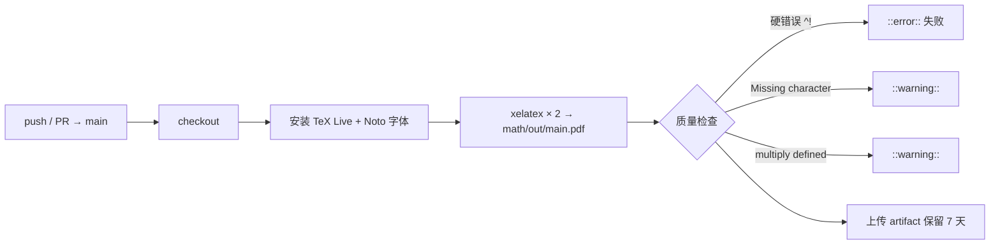

# 06 · 构建与发布指南

> 面向维护者：如何从源码构建 PDF、如何生成双版本、如何发布 GitHub Release、CI 如何工作。

## 1. 环境要求

| 依赖 | 用途 | 安装（Ubuntu/Debian） |
|---|---|---|
| TeX Live（xelatex） | 编译引擎 | `texlive-xetex texlive-latex-recommended texlive-latex-extra` |
| CJK 支持 | ctexbook 文档类 | `texlive-lang-chinese` |
| 字体 | Noto Serif / Sans / Mono + CJK | `fonts-noto fonts-noto-cjk` |
| 辅助包 | tikz/pgfplots/tcolorbox/listings 等 | `texlive-fonts-recommended texlive-fonts-extra` |

> CI 使用的完整安装清单见 `.github/workflows/build.yml`（含 latexmk，但实际构建仍直接调 xelatex）。

## 2. 基础构建（单版本）

```bash
# 数学
cd math
xelatex -interaction=nonstopmode -halt-on-error -output-directory=out main.tex
xelatex -interaction=nonstopmode -halt-on-error -output-directory=out main.tex

# 408
cd 408
xelatex -interaction=nonstopmode -halt-on-error main.tex
xelatex -interaction=nonstopmode -halt-on-error main.tex
```

**为什么编译两次**：第一次生成 `.aux`（引用、计数器）与 `.toc`（目录），第二次收敛页码与书签。跳过第二次会出现"Label(s) may have changed"警告和错误的目录页码。

**差异提示**：
- math 用 `-output-directory=out`（CI 同款）；408 直接输出到源目录（构建产物被 .gitignore 忽略，除 `math/out/main.pdf` 外无版本控制风险）；
- 构建成功后检查日志：`grep '^!' main.log` 应无输出（硬错误），`Missing character` 与 `multiply defined` 应尽量为 0。

## 3. 双版本构建（习题版 / 完整版）

核心原理：`main.tex` 中的 `\showsolutionstrue` 是唯一开关。翻转它并用不同 `-jobname` 输出两个 PDF。

```bash
cd math

# 版本 A：纯题目（隐藏解析）
sed -i 's/\\showsolutionstrue/\\showsolutionsfalse/' main.tex
xelatex -interaction=nonstopmode -halt-on-error -jobname=math-exercises main.tex
xelatex -interaction=nonstopmode -halt-on-error -jobname=math-exercises main.tex

# 版本 B：题目+解析（记得把开关改回来！）
sed -i 's/\\showsolutionsfalse/\\showsolutionstrue/' main.tex
xelatex -interaction=nonstopmode -halt-on-error -jobname=math-full main.tex
xelatex -interaction=nonstopmode -halt-on-error -jobname=math-full main.tex
```

**⚠️ 风险控制**：`sed` 改源码属于临时状态修改——若两步之间构建中断，仓库会留下 `\showsolutionsfalse` 的脏状态。建议：
1. 构建前 `git status` 确认工作区干净；
2. 构建后立即恢复开关并 `git diff` 验证无残留；
3. 长期方案：把双版本构建封装为脚本（`scripts/release.sh`）或 CI 双 job，避免手工 sed。

**版本命名约定**（与 v1.2.0 发布一致）：

| 文件 | 内容 | 实测页数（2026-09-03） |
|---|---|---|
| `math-exercises.pdf` | 数学 · 纯题目（含手写留白） | 376 |
| `math-full.pdf` | 数学 · 题目+解析 | 471 |
| `408-exercises.pdf` | 408 · 纯题目（含手写留白） | 374 |
| `408-full.pdf` | 408 · 题目+解析 | 378 |

## 4. 发布 GitHub Release

前置：双版本 PDF 已生成并复制到 `release/` 目录。

```bash
# ① 提交并推送（release/*.pdf 需强制跟踪，见 .gitignore）
git add release/*.pdf -f
git commit -m "release: vX.Y.Z"
git push

# ② 创建 Release（gh CLI 已登录）
gh release create vX.Y.Z \
  release/math-exercises.pdf \
  release/math-full.pdf \
  release/408-exercises.pdf \
  release/408-full.pdf \
  --title "NEPP_notes vX.Y.Z — 版本说明" \
  --notes "## 更新内容 ..."
```

**历史发布**：
- `v1.1.0`（2026-07-22）：每本书单一 PDF；
- `v1.2.0`（2026-07-31）：习题/解析分离，每本书两个 PDF。

## 5. CI 行为说明

`.github/workflows/build.yml`（仅覆盖 math）：



**已知缺口**：
- 408 未纳入 CI（构建回归无门禁）——优先补齐项；
- artifact 不自动发布为 Release（发布仍手工 gh CLI）；
- 不检查 Overfull/Underfull（排版警告量大，会淹没信号）。

## 6. 常见问题排查

| 症状 | 原因 | 处理 |
|---|---|---|
| `! LaTeX Error: File 'ctexbook.cls' not found` | 缺 `texlive-lang-chinese` | 安装后重试 |
| 中文显示为方块 | 缺 CJK 字体 | 安装 `fonts-noto-cjk` |
| `Font shape ... not available` | 字体形状回退 | 非致命，可忽略（中文斜体回退已知） |
| 目录页码错误 | 只编译了一次 | 再编译一次 |
| `Label(s) may have changed` | 同上 | 再编译一次 |
| `\ifshowsolutions` 未定义 | 在子文件单独编译（脱离了 main.tex） | 必须从 main.tex 整书编译 |
| 解析仍然显示（开关已关） | 子章节重复定义了开关 | 全局搜索删除局部 `\newif`/`\showsolutionstrue`（历史教训） |
| 编译卡死/内存不足 | tikz-feynman 等大图 | 使用 `-halt-on-error` 定位；必要时增加 TeX 内存（math/main.tex 头部有 `extra_mem_top` 注释示例） |
